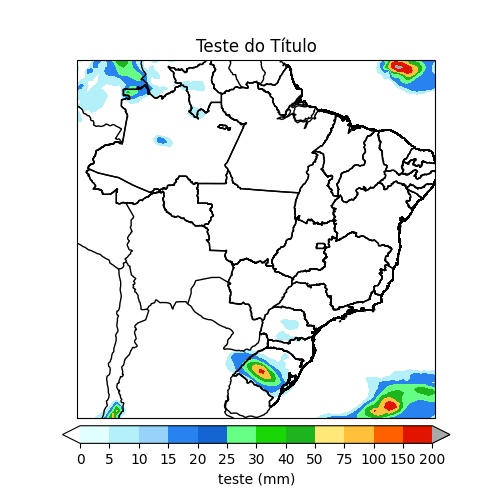

# plotMap
O projeto 'plotMap' tem por objetivo fornecer uma forma simples de plotar mapas.
O código é livre (licença MIT) e conto com a colaboração de todos para o seu aperfeiçoamento.

## Utilização:

Em breve. Mas o arquivo 'exemplo.py' já lhe dará uma boa noção de como utilizar o código.

## Dependências:

Matplotlib e Cartopy.

## Licença:

[Ver licença](LICENSE)

## Sobre o autor:

[Meu LinkedIn](www.linkedin.com/in/nelsonrossibittencourt)

[Minha página de projetos](www.nrbenergia.somee.com)

